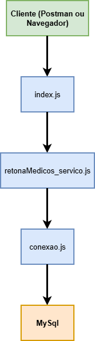

# projeto-api-clinica -  Projeto [DevMedia](https://www.devmedia.com.br)

**21º Projeto**: Esse projeto é uma API REST feita com JavaScript, Node.js, Express e com MySql que retorna uma lista de médicos de uma Clinica.

## 🛠 Tecnologias

- Node.js
- Express
- JavaScript
- MySql

## 📂 Documentação do Projeto

Os documento de fluxo e de componente estão no arquivo:

### Documentação de Fluxo
[Documento de Fluxo](./documentation/fluxo.md)

### Componentes da API:

# Update:

## Versão 2:

- Na quarta missão de **Criando sitemas Fullstack**, temos um exercicio em que pegamos a api e aplicamos, no front, fazendo a primeira aplicação, como eu queria testar primeiro uma api interna e não postada, deixei ela dentro do projeto [Pasta BackEnd](./backEnd/). As configurações estão na pasta do front, então não funcionará se baixar, pois o banco de dados ficou disponivel so pra mim. mas o codigo funciona normalment.