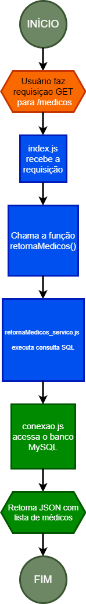

# Documento de Fluxo (Api Clinica) -  Projeto [DevMedia](https://www.devmedia.com.br)

## 1. Objetivo
- O objetivo deste projeto é criar uma **API para gerenciamento de médicos** de uma clínica de pediatria.
A API permitirá consultar informações sobre os médicos cadastrados, incluindo *nome*, *telefone*, *e-mail* e *descrições*.

## 2. Fluxo do Processo

### 2.1 Início
- O processo se inicia quando o usuário faz uma **requisição HTTP GET** para o endpoint: */medicos*.

### 2.2 Processar a Requisição
- O servidor **Express (index.js)** recebe a requisição e chama a função responsável por obter os dados.
- Essa função, fica no arquivo **retornaMedicos_servico.js**, é responsável por consultar o **banco de dados MySQL** através do módulo *conexao.js.*

### 2.3 Consulta no Banco de dados
- O arquivo **conexao.js** estabelece a conexão com o banco de dados e executa a consulta SQL: *SELECT*;
- O banco de dados retorna a lista de médicos cadastrados.

### 2.4 Retorno da Resposta
- Monta a resposta em formato **JSON**;
- Retorna o **status 200 (OK)** e os dados dos médicos.

### 2.6 Fim
- O processo termina após o envio da resposta ao cliente.

## Visual
;